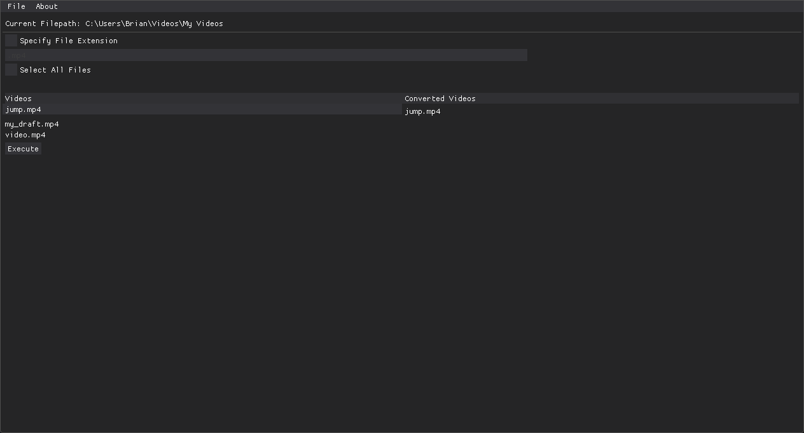
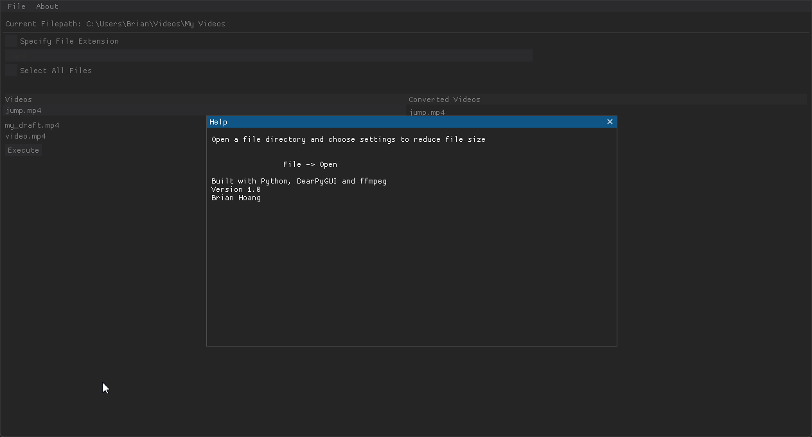

# reduce_video_size
 Python gui to reduce video file size using ffmpeg and dearpygui





# Requirements
```
Python 3.X, DearPyGUI
```
# Usage
Open a folder, select the desired videos to compress, press execute ! 
